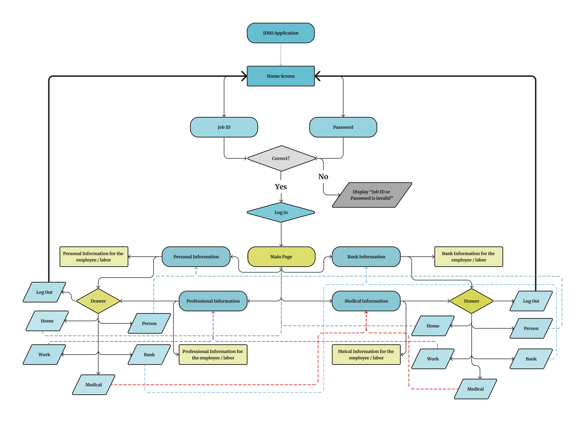

# StaffBridge-App

## Overview
StaffBridge is a **self-service mobile application** designed for employees in small and medium companies to easily view and manage their personal and professional information. The app provides a centralized platform where employees can see their job details, banking and salary information, and medical insurance data without needing to contact HR. The system was planned to be expanded with an **Admin Portal** that allows managers to view employee profiles and search records directly.

## Features
- **Employee Login** using employee ID and password  
- **Personal Information** page  
- **Professional Information** page  
- **Bank & Salary Details**  
- **Medical Insurance Information**  
- **Navigation Drawer** for easy movement between pages  
- **Clean and simple UI design**  
- **Modular code structure** using Flutter pages

## Technology Stack
- Flutter  
- Dart  
- VS Code  
- MySQL  
- PHP (planned)

## Project Structure
**lib/**  
Contains the main Flutter application files and page layouts.

**Diagrams/**  
Includes the full system flow diagram (Flowchart.png).

**Screens/**  
Contains the UI design PDF for all application screens.

## Flow Diagram
The full system flow including login, navigation, and data pages:

## UI Design
Complete application UI screens are available in PDF format:
[View UI Design (PDF)](Screens/UI-Design.pdf)

## Future Enhancements
- Add full **Admin Portal** for managers  
- Connect the app to **live MySQL database** using PHP or API  
- Add employee profile editing  
- Add notification system (salary updates, insurance renewal, etc.)  
- Role-based access (Employee / HR / Manager)
